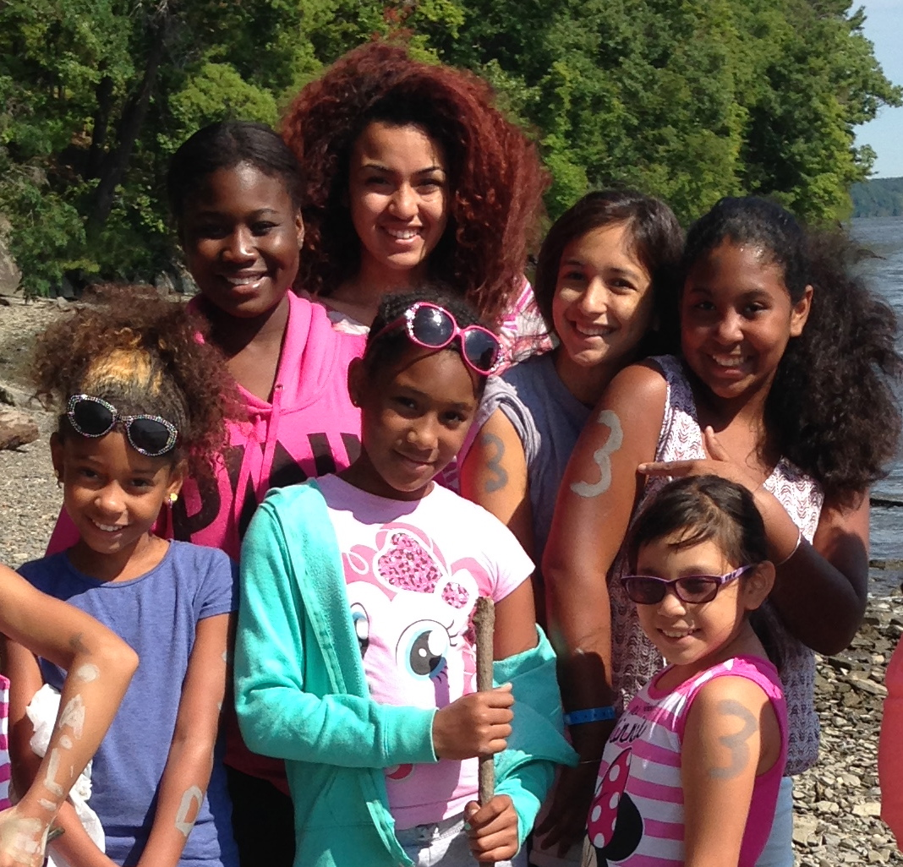

## Community Engagement

I devote my free time to a variety of organizations in my community. Most of my work focuses on issues that disproportionally affect the Latino community, including: immigration, prison reform, and equity in STEM education. Below, I have highlighted a few organizations that I have done long term work with, but I also routinely participate in one time speaking engagements or workshops with student groups. If you are interested having me speak to your students about the importance of higher education and opportunities in Science Technology Engineering and Mathematics, please contact me via email. 

## Sacred Heart Summer Camp

 Sacred Heart Highbridge is an elementary and middle school in the South Bronx, New York. Every summer a group of their students travel upstate to Esopus, NY for a week of fishing, swimming, camping, and other activities that may not be available to them at home. For the past eight years, I've had the privilege of spending a week each summer with these kids as their counselor. In my time with them, I have seen my first group of third graders graduate from camp and come back as counselors, volunteering their time to a new group of children. To learn more about Sacred Heart Camp, please visit their [web site](http://sacredheartsummercamp.org/)