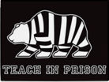
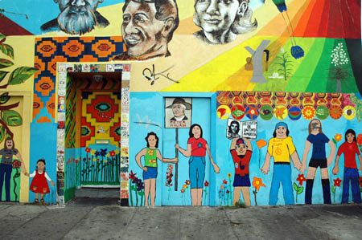

## Community Engagement

I devote my free time to a variety of organizations in my community. Most of my work focuses on issues that disproportionally affect the Latino community, including: immigration, prison reform, and equity in STEM education. Below, I have highlighted a few organizations that I have done long term work with, but I also routinely participate in one time speaking engagements or workshops with student groups. If you are interested having me speak to your students about the importance of higher education and opportunities in Science Technology Engineering and Mathematics, please contact me via email. 

## Sacred Heart Summer Camp

 Sacred Heart Highbridge is an elementary and middle school in the South Bronx, New York. Every summer a group of their students travel to the Marist Retreat Center in Esopus, NY for a week of fishing, swimming, camping, and other activities that may not be available to them at home. For the past eight years, I've had the privilege of spending a week each summer with these kids as their counselor. To learn more about Sacred Heart Camp, please visit their [web site](http://sacredheartsummercamp.org/)

## Teach in Prison

 Teach in Prison is a course run by UC Berkeley's DeCal (Democratic Education at Cal) Program. Through this program I was able to volunteer as a tutor at San Quentin State Prison for the 2014-15 school year. I primarily worked in the ESL room, helping inmates whose first language is not English improve their language and math abilities in preparation for their GEDs. For more information about the program please visit their [web site](http://teachinprison.berkeley.edu/Teach_in_Prison/Home.html) To learn more about the intersection of education and incarceration please check out the [underground scholars initiative](https://callink.berkeley.edu/organization/usi) at UC Berkeley. 

## The Oakland Catholic Worker
 For the past year I have had the privilege of sitting on the board of directors of the Oakland Catholic Worker. We serve as a house of hospitality, offering transitional housing for Latin American refugees. During my tenure, I also taught ESL classes to members of the community and started a free ballet program for children in our East Oakland neighborhood. Please take a look at our [web site](http://www.oaklandcatholicworker.org/)

## The Ponheary Ly Foundation
 Before starting as an undergraduate at Cal, I took a year off to volunteer with the Ponheary Ly Foundation in Siem Reap, Cambodia. I spent that time teaching English in Tchey village outside of Siem Reap as well as teaching night classes in town. I enjoyed my time there so much, that I studied the Khmer language at Berkeley and returned in the winter of 2012 to teach a month long, Khmer language math class at Tchey School. The PLF continues to do great work around education in Cambodia. Take some time to explore their [web site](theplf.org)